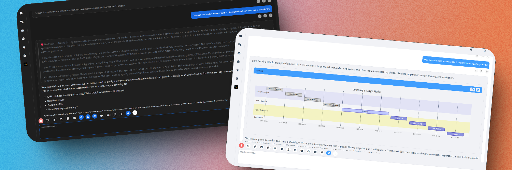

<div align="center">
  <a href="./README_ZH.md"></a>
  <a href="./README.md"></a>
</div>

## 简介

🚀 零侵入 · 极简扩展 · 让LLM API获得企业级能力无需修改一行代码，为您的LLM接口无缝附加知识库、实时联网、MCP、A2A、深度思考控制、深度研究、自定义工具等高阶功能，打造可插拔的LLM增强中台。



## 为什么选择我们？
- ✅高效开发：支持流式输出，完全不影响原有API的反应速度，无需修改调用的代码
- ✅快速接入：避免为单一功能重复对接多个服务商，预置主流LLM厂商/智能体协议适配器，兼容OpenAI/Ollama/MCP/A2A等，即刻体验下一代LLM中间件
- ✅高度定制：支持自定义知识库、实时联网、MCP、A2A、深度思考控制、深度研究、自定义工具等高级智能体功能，打造可插拔的LLM增强中台。自定义后的智能体可以快照保存，方便下次使用。快照后的智能体可以使用openai API直接调用。
- ✅数据安全：支持本地知识库、本地模型接入等，数据不外泄，确保企业数据安全。所有的文件将缓存到本地，不会上传到任何地方。
- ✅团队协作：支持团队协作，多人共享知识库、模型服务、工具、MCP、A2A等资源，提高团队协作效率。聊天记录或知识库中的所有文件、图片都被存放到本地，可以作为内网文件床、图床使用。

## 快速开始

### windows桌面版安装

  👉 [点击下载](https://github.com/heshengtao/super-agent-party/releases/download/v0.1.3/Super-Agent-Party-Setup-0.1.3.exe)

⭐注意！安装时选择仅为当前用户安装，否则启动时需要管理员权限。

### Linux 桌面版安装

我们提供了两种主流的 Linux 安装包格式，方便你在不同场景下使用。

#### 1. 使用 `.AppImage` 安装（推荐）

`.AppImage` 是一种无需安装、即开即用的 Linux 应用格式。适用于大多数 Linux 发行版。

  👉 [点击下载](https://github.com/heshengtao/super-agent-party/releases/download/v0.1.3/Super-Agent-Party-0.1.3-Linux.AppImage)


#### 2. 使用 `.deb` 包安装（适用于 Ubuntu / Debian 系统）

  👉 [点击下载](https://github.com/heshengtao/super-agent-party/releases/download/v0.1.3/Super-Agent-Party-0.1.3-Linux.deb)

### docker部署（推荐）

- 两行命令安装本项目：
  ```shell
  docker pull ailm32442/super-agent-party:latest
  docker run -d -p 3456:3456 -v ./super-agent-data:/app/data ailm32442/super-agent-party:latest
  ```

- ⭐注意！`./super-agent-data`可以替换为任意本地文件夹，docker启动后，所有数据都将缓存到该本地文件夹，不会上传到任何地方。

- 开箱即用：访问http://localhost:3456/

### 源码部署

- windows ：
  ```shell
  git clone https://github.com/heshengtao/super-agent-party.git
  cd super-agent-party
  uv sync
  npm install
  start_with_dev.bat
  ```

- linux or mac ：
  ```shell
  git clone https://github.com/heshengtao/super-agent-party.git
  cd super-agent-party
  uv sync
  npm install
  chmod +x start_with_dev.sh
  ./start_with_dev.sh
  ```

详细部署方法请参考[部署和使用文档](doc/install_config_ZH.md)

## 使用方法

- 桌面端：点击桌面端图标即可开箱即用。

- web端或docker端：启动后访问http://localhost:3456/

- API调用：开发者友好，完美兼容openai格式，可以流式输出，完全不影响原有API的反应速度，无需修改调用的代码：

  ```python
  from openai import OpenAI
  client = OpenAI(
    api_key="super-secret-key",
    base_url="http://localhost:3456/v1"
  )
  response = client.chat.completions.create(
    model="super-model",
    messages=[
        {"role": "user", "content": "什么是super agent party？"}
    ]
  )
  print(response.choices[0].message.content)
  ```

- MCP调用：启动后，在配置文件中写入以下内容，即可调用本地的mcp服务：

  ```json
  {
    "mcpServers": {
      "super-agent-party": {
        "url": "http://127.0.0.1:3456/mcp",
      }
    }
  }
  ```

## 最近更新

以下内容已合并到主分支，但还未加入发行版：

1. 添加存储空间管理功能，可以在存储空间查看聊天时上传的文件和图片，均缓存在本地，增强了软件的图床和文件床功能。
2. 添加文件/图片链接查看工具，可以让大模型能根据用户发送的URL来获取文件/图片信息。也可以用来查看服务器内部的文件或者图片信息，甚至是聊天记录中的工具结果。工具结果将不占用上下文，而是作为单独的文件存储，可以供大模型随时查看，实现大模型的备忘录功能。
3. 目前已支持MCP的方式调用agent party中配置好的智能体。
4. openai接口添加了如下开关参数：
  - enable_thinking: 默认为False，是否启用思考模式
  - enable_deep_research: 默认为False，是否启用深度研究模式
  - enable_web_search: 默认为False，是否启用网络搜索
5. 知识库支持了rerank模型，可以提升知识库的检索效果。
6. 接入智能体的MCP工具已支持流式HTTP。
7. 主模型配置界面支持了额外参数的配置，配置一些自定义参数。
8. 知识库支持了混合搜索功能，可以选择关键词搜索和语义搜索之间的比例。

## 功能

0. 从侧边栏切换到调用方法，可以查看怎么以Openai API、MCP服务器、docker、web端方式调用Agent Party。openai接口添加了如下开关参数：
  - enable_thinking: 默认为False，是否启用思考模式
  - enable_deep_research: 默认为False，是否启用深度研究模式
  - enable_web_search: 默认为False，是否启用网络搜索
1. 知识库，让大模型能够根据知识库中的信息进行回答。并支持如下功能：
  - 如果有多个知识库，模型会根据提问需求去主动查询对应的知识库。
  - 可以选择检索时机，可以选择主动检索或者被动检索知识库。
  - 支持了rerank模型，可以提升知识库的检索效果。
  - 支持混合搜索功能，可以选择关键词搜索和语义搜索之间的比例。
2. 联网功能，让大模型能够根据提问需求去主动联网查询信息。目前已支持：
- [duckduckgo](https://duckduckgo.com/)（完全免费，中国网络环境无法访问）
- [searxng](https://github.com/searxng/searxng)（可以docker本地部署）
- [tavily](https://tavily.com/)（需要申请api key）
- [jina](https://github.com/jina-ai/jina)（可以无需api key，用于网页抓取）
- [crawl4ai](https://github.com/unclecode/crawl4ai)（可以docker本地部署，用于网页抓取）。
3. [MCP](https://modelcontextprotocol.io/introduction)服务，让大模型能够根据提问需求去主动调用MCP服务。目前支持三种调用方式：标准输入输出、服务器发送事件 (SSE)、流式HTTP、websocket。
4. [A2A](https://github.com/google/A2A)服务，让大模型能够根据提问需求去主动调用A2A服务。
5. 深度思考，可以将推理模型的推理能力移植到可以工具调用或多模态模型中，让大模型在工具调用之前先利用推理模型进行推理分析。例如：deepseek-V3可以工具调用，但是推理模型deepseek-R1无法工具调用，那么就可以将deepseek-R1的推理能力移植到deepseek-V3中，让deepseek-V3在工具调用之前先利用deepseek-R1进行推理分析。
6. 深度研究，将用户的问题转化成任务，逐步分析推理后调用工具，输出结果后会重新检查任务是否完成，如果任务未完成，则继续分析推理后调用工具，直到任务完成。
7. 自定义LLM工具，可以将LLM接口转换成LLM工具，任何适配ollama格式或者openai接口的项目，都可以作为工具使用。
8. 视觉缓存，可以单独配置视觉模型，用于识别图片信息，识别的结果将被缓存，以节省token。配置视觉模型可以让一些无视觉能力的模型（例如大部分的推理模型等）获得视觉能力。
9. 存储空间管理功能，可以在存储空间查看聊天时上传的文件和图片，均缓存在本地，增强了软件的图床和文件床功能。
10. 已实现的小工具：当前时间、获取文件/图片URL中的内容、伪推理、Pollinations 图像生成、latex公式渲染增强、语言语气。
  - 当前时间：获取当前时间。
  - 获取文件/图片URL中的内容：获取文件/图片URL中的内容。
  - 伪推理：让没有推理能力的模型获得推理能力。
  - Pollinations 图像生成：调用Pollinations 图像生成API，生成图片。（无需API key）
  - latex公式渲染增强：控制大模型更稳定的输出latex公式。
  - 语言语气：控制大模型更稳定的输出语言和语气。

## 免责声明：
本开源项目及其内容（以下简称“项目”）仅供参考之用，并不意味着任何明示或暗示的保证。项目贡献者不对项目的完整性、准确性、可靠性或适用性承担任何责任。任何依赖项目内容的行为均需自行承担风险。在任何情况下，项目贡献者均不对因使用项目内容而产生的任何间接、特殊或附带的损失或损害承担责任。

## 许可证协议

本项目采用双许可证授权模式：
1. 默认情况下，本项目遵循 **GNU Affero General Public License v3.0 (AGPLv3)** 授权协议
2. 若需将本项目用于闭源的商业用途，必须通过项目管理员获取商业授权许可

未经书面授权擅自进行闭源商业使用的，视为违反本协议约定。AGPLv3 完整文本可在项目根目录的 LICENSE 文件或 [gnu.org/licenses](https://www.gnu.org/licenses/agpl-3.0.html) 查阅。

## 支持：

### 加入社群
如果项目存在问题或者您有其他的疑问，欢迎加入我们的社群。

1. QQ群：`931057213`

<div style="display: flex; justify-content: center;">
    
</div>

2. 微信群：`we_glm`（添加小助手微信后进群）

3. discord:[discord链接](https://discord.gg/f2dsAKKr2V)

### 关注我们
1. 如果想持续关注本项目的最新功能，欢迎关注B站账号：[派酱](https://space.bilibili.com/26978344)

### 捐赠支持
如果我的工作给您带来了价值，请考虑请我喝一杯咖啡吧！您的支持不仅为项目注入活力，也温暖了创作者的心。☕💖 每一杯都有意义！
<div style="display:flex; justify-content:space-between;">
    
    
</div>